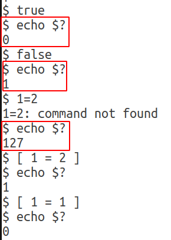
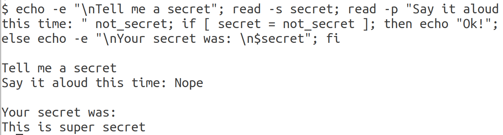
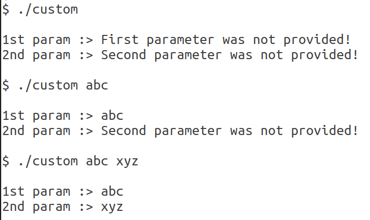

# Bash Scripting

1. Life's all about **if**'s and **else**'s. When you are talking in Bash, how do you make your choice?

    ```bash
    #!/bin/bash -x

    something=1
    something_else=2

    if [ $something = $something_else ]; then
        echo "Why don't you do something!";
    elif [ "$(id -u)" = "0" ]; then
        echo "You must be root. Are you?";
    else
        echo "Let's just exit."
        exit 1
    fi
    ```

2. Check the **exit status** of last run command by running `echo $?` command in the terminal window.

   

   `0` indicates that command was run successfully. Any other numerical value is an indication of an error.

3. How would you interact with someone? Would you read their mind secretly `read -s secret`? Or, would you let them say it out loud `read -p "Say it aloud this time: " not_secret`

    ```bash
    echo -e "\nTell me a secret"; read -s secret; read -p "Say it aloud this time: " not_secret; if [ secret = not_secret ]; then echo "Ok!"; else echo -e "\nYour secret was: \n$secret"; fi
    ```

    

4. Try integer arithmetic: `echo $((2+5))`
5. Use `case` as an alternative to multiple `if` and `else` statements

    ```bash
    #!/bin/bash
    
    mynumber=0

    read -p "Enter a character > " input
    case $input in
            [[:lower:]] | [[:upper:]] ) echo "Character found - $input"
                    ;;
            [0-9] ) echo "Number found - $((mynumber + input))"
                    ;;
            * ) echo "Everything  else"
    esac
    ```

    The `case` command has following form:

    ```bash
    case word in
        patterns ) commands ;;
    esac
    ```

6. Take control of the **positional parameters** using `$#`, `$1` and `shift`

    ```bash
    #!/bin/bash
    
    echo -e "\nYou have entered $# positional parameters:"

    # Loop until all parameters are used up
    while [ "$1" != "" ]; do
        echo ">> $1"

        # Shift all the parameters down by one
        shift
    done
    ```

    Alternatively, access all **command line arguments** using `$@`

    ```bash
    #!/bin/bash

    for i in "$@"; do
        echo $i
    done
    ```

7. Explore the varieties offered by `test` command: `man test`

    ```bash
    if [ "$interactive" = "1" ]; then

        response=

        read -p "Enter name of output file [$filename] > " response

        #Test if response is empty
        if [ -n "$response" ]; then
            filename="$response"
        fi

        #Test if file exists
        if [ -f $filename ]; then
            echo -n "Output file exists. Overwrite? (y/n) > "
            read response
            if [ "$response" != "y" ]; then
                echo "Exiting program."
                exit 1
            fi
        fi
    fi
    ```

8. Use **command substitution** in `for` loop

    ```bash
    #!/bin/bash

    count=0
    for i in $(cat ~/.bash_profile); do
        count=$((count + 1))
        echo "Word $count ($i) contains $(echo -n $i | wc -c) characters"
    done
    ```
9. Surround a variable name with curly braces, e.g., `${VARIABLE_NAME}`, to separate it from its surrounding text

10. What if a command line parameter was not provided by user? Use `${1:-"Custom Message Here"}` to handle a scenario wherein if first parameter `$1` was undefined or not provided by user, then, a custom string value would be used instead.

    ```bash
    #!/bin/bash
    
    param1=${1:-"First parameter was not provided!"}

    echo -en "\n1st param :> ${param1}"
    echo -en "\n2nd param :> ${2:-"Second parameter was not provided!"}\n\n"
    ```

    

## References

* [Writing Shell Scripts](http://linuxcommand.org/lc3_wss0010.php)
* [All about redirection](https://tldp.org/HOWTO/Bash-Prog-Intro-HOWTO-3.html)
* [The Linux Command Line](http://linuxcommand.org/tlcl.php)