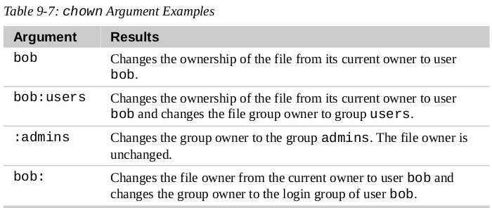

# Changing Identity

1. Start a shell for the **superuser**

        su -
        su -l

2. Execute a **single command** as superuser

        su -c 'command'
        su -c "ls -l /root/*"

3. Start an interactive superuser session using "**sudo**"

        sudo -i

   `sudo` does not require access to superuser's password, instead it requires the user’s own password. Also, `sudo` does not start a new shell, nor does it load another user's environment.

4. Check what **privileges** are granted by `sudo`

        sudo -l

5. "**chown**" can change the file owner and/or the file group owner

        chown [owner][:[group]] file...

    

6. Create a **new group**

        groupadd group1

7. Create two **new users**, set account password and add both users to a **common group**

        useradd -G group1 userA
        passwd userA
        useradd -G group1 userB
        passwd userB

8. Change the **login shell** for new user accounts  to `/bin/bash`

        usermod -s /bin/bash userA

9. Add a user to "**sudo**" group

        useradd -aG sudo userA

10. Start a new shell as a different user
    
        su - userA

11. Check to which **groups** does the current user belong to

        userA@master-node:~$ groups
        userA sudo group1

12. Create a **shared folder**

        userA@master-node:~$ sudo mkdir /usr/local/share/Music
        [sudo] password for userA: 
        userA@master-node:~$ ls -ld /usr/local/share/Music
        drwxr-xr-x 2 root root 4096 Oct  7 14:20 /usr/local/share/Music

13. To make this directory sharable, change the group ownership and the group permissions to **allow writing**

    **Change group:**

        userA@master-node:~$ sudo chown :group1 /usr/local/share/Music/
        userA@master-node:~$ ls -ld /usr/local/share/Music/
        drwxr-xr-x 2 root group1 4096 Oct  7 14:20 /usr/local/share/Music/

    **Change permission:**

        userA@master-node:~$ sudo chmod 775 /usr/local/share/Music/
        userA@master-node:~$ ls -ld /usr/local/share/Music/
        drwxrwxr-x 2 root group1 4096 Oct  7 14:20 /usr/local/share/Music/

    Now, we have a directory that is owned by `root` and allows read and write access to group `group1`. Group members can create files in this shared directory. Any other user can only list the contents of the directory but cannot create files.

14. **Files and directories** created inside the shared directory will have the **normal permissions** of current user, and will be set to the primary group of the user rather than the shared group `group1`.

        userA@master-node:~$ ls -la /usr/local/share/Music/test_file
        -rw-rw-r-- 1 userA userA 0 Oct  7 14:35 /usr/local/share/Music/test_file

15. Set **umask** to `0002`

        umask 0002

16. Set the **setgid bit** on the shared directory

        userA@master-node:~$ sudo chmod g+s /usr/local/share/Music/
        userA@master-node:~$ ls -ld /usr/local/share/Music
        drwxrwsr-x 2 root group1 4096 Oct  7 14:35 /usr/local/share/Music

    ---

        userA@master-node:~$ > /usr/local/share/Music/test_file2
        userA@master-node:~$ mkdir /usr/local/share/Music/test_dir
        userA@master-node:~$ ls -lAt /usr/local/share/Music
        total 4
        drwxrwsr-x 2 userA group1 4096 Oct  7 14:49 test_dir
        -rw-rw-r-- 1 userA group1    0 Oct  7 14:48 test_file2
        -rw-rw-r-- 1 userA userA     0 Oct  7 14:35 test_file

    All group members can now create both files and directories with the **correct permissions**, inside the **shared directory**.

## References:

* [TheLinuxCommandLine-19.01.pdf](http://sourceforge.net/projects/linuxcommand/files/TLCL/19.01/TLCL-19.01.pdf/download)