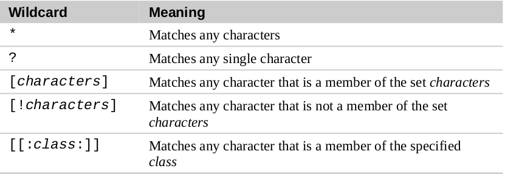
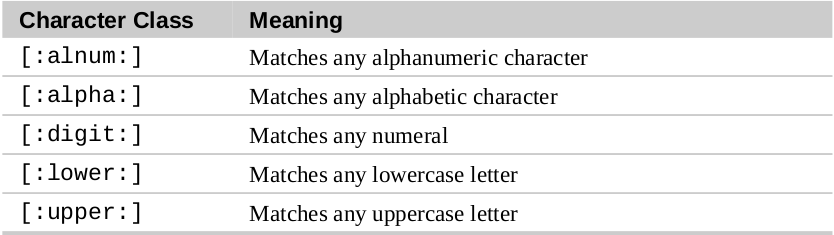
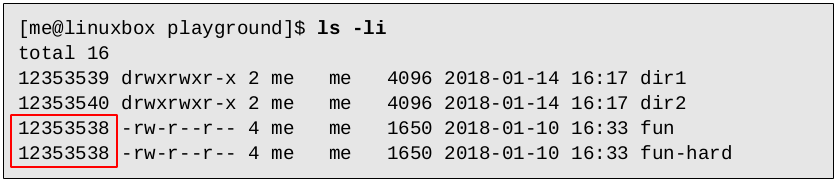
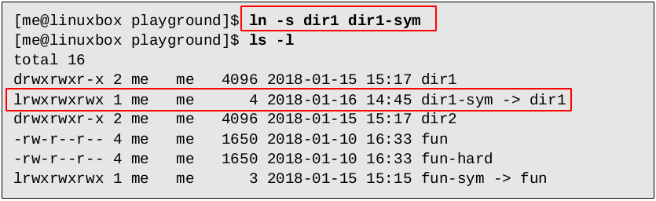
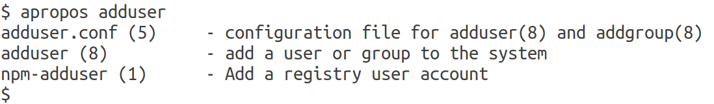

# A Few Useful Commands

1. Check **free space** on disk drives: `df`
2. Check for **free memory**: `free`
3. Exit terminal session: `exit` | `Ctrl-d` 
4. Access **virtual consoles** by pressing `Ctrl-Atl-F1` through `Ctrl-Atl-F6`. Return to graphical desktop by pressing `Alt-F7`.
5. Print working directory: `pwd`

    > When we first log in to our system (or start a terminal emulator session) our current working directory is set to our home directory. Each user account is given its own home directory and it is the only place a regular user is allowed to write files.

6. Change to your **home** directory: `cd`
7. Change to **previous working directory**: `cd -`
8.  Change to working directory of a **specific user**: `cd ~user_name`
9.  Copy files that do not exist in the destination directory or are **newer** than the versions in the destination directory

        cp -u *.html /destination/path

10. `Globbing` means using wildcards to select filenames based on patterns of characters

    

11. Commonly used character classes

    

12. Identify a **hard link** by viewing the inode number: `ls -li`

    

    As both `fun` and `fun-hard` share the same inode number, this confirms that they are the same file.

13. Create **symbolic link** for a file or a folder: `ln -s file_or_folder_path symlink_path`

    

14. Display a command's **type**: 
    1.  `type type`
    2.  `type ls`
    3.  `type cp`

15. Determine the exact **location** of a given **executable**: `which ls`
16. The “manual” that **man** command displays is broken into sections

    Section | Contents
    --- | ---
    1 | User commands
    2 | Programming interfaces for kernel system calls
    3 | Programming interfaces to the C library
    4 | Special files such as device nodes and drivers
    5 | File formats
    6 | Games and amusements such as screen savers
    7 | Miscellaneous
    8 | System administration commands

    A specific section of the manual could be referenced by specifying the section number: `man 5 passwd`

17. Use `apropos` or `man -k` to search the list of man pages for **possible matches** based on a search term: 
    1. `man -k adduser`
    2. `apropos adduser`

        

18. Use `whatis` to view **one line manual** page descriptioin: `whatis ls`

    

19. Use `zless` to **view** contents of a **gzip-compressed** text file: `zless /path/to/compressed_file.gz`
20. Record shell session using `script`

        script filename.txt

    To stop recording, press `Ctrl-d`

## References:

* [TheLinuxCommandLine-19.01.pdf](http://sourceforge.net/projects/linuxcommand/files/TLCL/19.01/TLCL-19.01.pdf/download)
* [Steve Bourne, father of the Bourne Shell](https://en.wikipedia.org/wiki/Stephen_R._Bourne)
* [Brian Fox, the original author of bash](https://en.wikipedia.org/wiki/Brian_Fox_(computer_programmer))
* [Concept of shells in computing](https://en.wikipedia.org/wiki/Shell_(computing))
* [Linux Filesystem Hierarchy Standard](https://www.pathname.com/fhs/)
* [Conventional directory layout](https://en.wikipedia.org/wiki/Unix_filesystem#Conventional_directory_layout)
* [ASCII text format](https://en.wikipedia.org/wiki/ASCII)
* [Symbolic link](https://en.wikipedia.org/wiki/Symbolic_link)
* [Bash Reference Manual](http://www.gnu.org/savannah-checkouts/gnu/bash/manual/bash.html)
* [Official GNU packages](http://www.gnu.org/manual/manual.html)