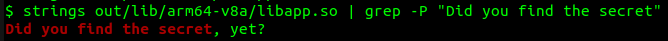
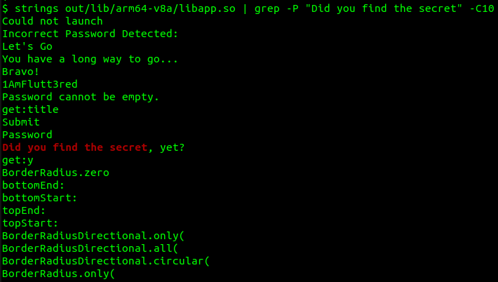

# [Hands-On] Finding Secrets in Flutter App

1. Download APK according to architecture supported by your target mobile device/emulator
   * [app-arm64-v8a-release.apk](res/app-arm64-v8a-release.apk)
   * [app-armeabi-v7a-release.apk](res/app-armeabi-v7a-release.apk)
   * [app-x86_64-release.apk](res/app-x86_64-release.apk)

2. Create an [Android Virtual Device](https://developer.android.com/studio/run/managing-avds) (AVD)
3. Install APK
   
        adb install app-x86_64-release.apk
    
4. Start the app and explore its features

    

5. Unzip the APK: 
   
        unzip app-arm64-v8a-release.apk -d out
    
6. Search for the presence of a known string
   
        grep -r -Pio "Did you find the secret"

    

7. If a file is found containing the search string, explore it further

        strings out/lib/arm64-v8a/libapp.so | grep -P "Did you find the secret"

    

    ---

        strings out/lib/arm64-v8a/libapp.so | grep -P "Did you find the secret" -C10

    

8. Can you find the secret password?